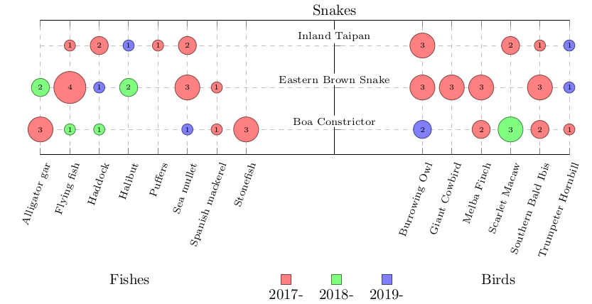

# Bubble Plot

Bubble plot are a type of visualisation used, for instance in a `Systematic Mapping Study`.

See [Petersen, Kai, et al. "Systematic mapping studies in software engineering." Ease. Vol. 8. 2008](https://www.researchgate.net/profile/Michael_Mattsson/publication/228350426_Systematic_Mapping_Studies_in_Software_Engineering/links/54d0a8e90cf20323c218713d/Systematic-Mapping-Studies-in-Software-Engineering.pdf) for a presentation of this methodology.

The purpose of this Python module is to automate the generation of the CSV file and the preparation of the Latex source file used to generate a bubble plot using [PGF/TikZ](https://www.ctan.org/pkg/pgf).

The following figure display a bubble plot generated with the following [Latex code](example/example.tex) using the following [dummy data](example/test.csv).

## How to use the `bubble_plot` module?

Please follow the instructions of the [Jupyter](https://jupyter.org/) notebook [usage_example.ipynb](example/usage_example.ipynb).

## WIP

- [X] Implement, document, and test the bubble plot data generation.
- [X] Generate the Latex source code parametrised for a given bubble plot.
- [X] Provide an example of interaction with the `bubble_plot` module.
- [ ] Document the Latex template variable & keys to manually change.
- [ ] Add support to custom colour scheme for the bubbles (e.g. using `seaborn`).

To think about:
- [ ] The field `years` is in the `.sty`. How to extract it to be configurable?
- [ ] Remove all IO interactions from the `bubble_plot` module?

## Documentation generation

First install `sphinx`. For example via: `pip3 install sphinx`.

Then, from [docs/](docs/) run: `make html && open _build/html/index.html`

## Run tests

Run `python3 -m unittest test_bubble_plot.py`
